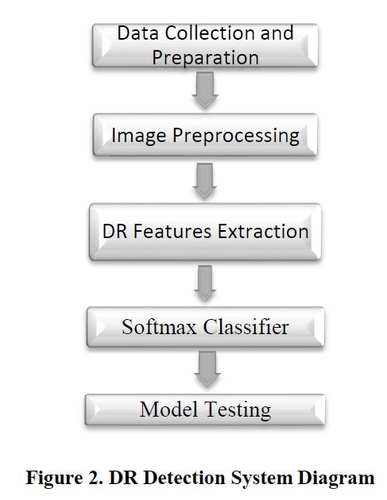

#Diabetic Retinopathy Using CNN

Techniques Used -CNN, Inception/Mobinet
Dataset Source -Kaggle DR challenge

*Abstract*

Annotated training data insufficiency remains to be one of the challenges of applying deep learning in medical data classification problems. Transfer learning from an already trained deep convolutional network can be used to reduce the cost of training from scratch and to train with small training data for deep learning. This raises the question of whether we can use transfer learning to overcome the training data insufficiency problem in deep learning based medical data classifications.
Inception modules that help to extract different sized features of input images in one level of convolution are the unique features of the Inception-V3.Using a pre-trained Inception-V3 model to take advantage of its Inception modules for Diabetic Retinopathy detection.

*KeyFeature*

**Transfer learning** is the reuse of deep learning models that are pre-trained on huge datasets such as subsets of the ImageNet project [9] to fit to a previously unseen dataset. Deep Learning (DL) is a subset of machine learning that takes advantage of the availability of huge training data and high computational power in solving problems such as classification and regression. Convolutional neural network (CNN) [10] is one example of DL architecture that are more suited to signals with multiple arrays such as images and videos.
DL depends on huge amount of training dataset to correctly work. The lack of enough annotated training data has been identified as one of the key challenges of applying DL in healthcare.

*Proposal*

Feature extraction based classification and DL has been used to classify DR.Support vector machine was used to classify the DR dataset into positive and negative classes using area and number of microaneurysms as features.Feature extraction based classification methods need expert knowledge in order to detect the required features, and they also involve a time consuming process of feature selection, identification and extraction.CNNs have been seen to outperform feature extraction based methods

*Training*

A CNN was trained from scratch to classify fundus images from the Kaggle dataset into referable and non-referable classes, and it scored a sensitivity of 96.2% and a specificity of 66.6% [30]. A dataset of 71896 fundus images was used to train a CNN DR classifier and resulted in a sensitivity of 90.5% and specificity of 91.6% [31]. A DL model was designed and trained on a dataset of 75137 fundus images and resulted in a sensitivity and specificity scores of 94% and 98%, respectively.After using data augmentation to balance the dataset, [33] reached at an accuracy score of 93% on the Inception-V3, and 74.49% on the Xception model.

*Analysis*

The fundus images were cropped from the input images to remove the black surrounding pixels using Opencv-Python. After cropping, the images were resized to 300x300. The local average was subtracted from each pixel [44].For model training, 1250 images were selected from the normal fundus images dataset for the healthy class, and 250 images were selected from each of the remaining four classes and put in the unhealthy class. For model testing, 1000 fundus images were selected from the normal dataset for healthy class and for the unhealthy class 1000 fundus images were selected from each of the four remaining classes.

The architecture of a deep CNN contains two basic parts: a convolutional and classifier part. While the convolutional part convolves with input data and extracts the separating characteristics of the different classes, the classifier part classifies the input data based on the collected characteristics.

*Advantages*
Based on the above analysis, high accuracy is achieved and is a light weight yet efficient model can be deployed any where and with an accuracy of 95.6% the model is super efficient.

*Disadvantages*
We also observed that the model is good enough but understanding the underlying and exact region of affected area in the image is quite difficult for clinicians. Only stages of diabetes can be determined but the regions cannot be understood.

**References**
https://arxiv.org/pdf/1905.07203.pdf

